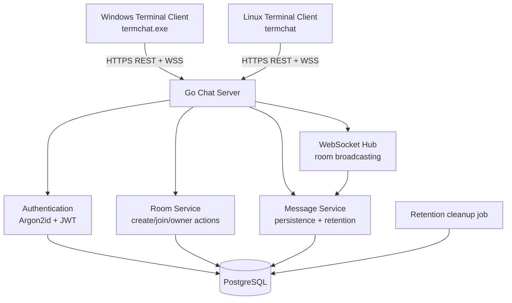

# TermChat — Genel Mimari Şeması

## Hedef

TermChat, Windows ve Linux terminallerinde çalışan, kullanıcı hesaplı, oda parolalı ve gerçek zamanlı bir sohbet uygulamasıdır. Oda listeleri public değildir; kullanıcılar oda adını ve parolasını bilerek katılır.

## Bileşenler

## Sunucu sorumlulukları

- Kayıt ve login işlemleri
- JWT oluşturma ve doğrulama
- Oda oluşturma, oda parolası doğrulama, parola değiştirme ve silme
- WebSocket bağlantılarının kimlik doğrulaması ve room bazında yönetimi
- Mesaj doğrulama, kalıcılık ve yayınlama
- Kullanıcı başına mesaj hız sınırı
- Süresi dolan mesajların periyodik temizliği

## İstemci sorumlulukları

- Kullanıcı giriş/kayıt deneyimi
- Token'ı ilk sürümde yerel uygulama verisinde saklama
- Oda oluşturma ve `/join <oda-adı>` akışı
- Parolayı maskeli TUI alanında girme
- Son 50 mesajı gösterme, yeni mesajları canlı ekleme ve komutları işleme
- Bağlantı kesildiğinde kullanıcıyı bilgilendirme; MVP’de otomatik reconnect yoktur

## Çapraz platform prensipleri

- Tek Go kod tabanından `GOOS=windows` ve `GOOS=linux` derlemesi alınır.
- TUI; terminal boyutu değişimi, Unicode kullanıcı/metin içeriği ve Windows/Linux giriş davranışlarıyla test edilir.
- Terminal input'u ile mesaj akışı Bubble Tea olay döngüsünde ayrıştırılır; gelen mesaj yazılan metni bozmaz.
- Platforma özgü shell komutlarına veya dosya yollarına istemci iş mantığında bağımlılık oluşturulmaz.
