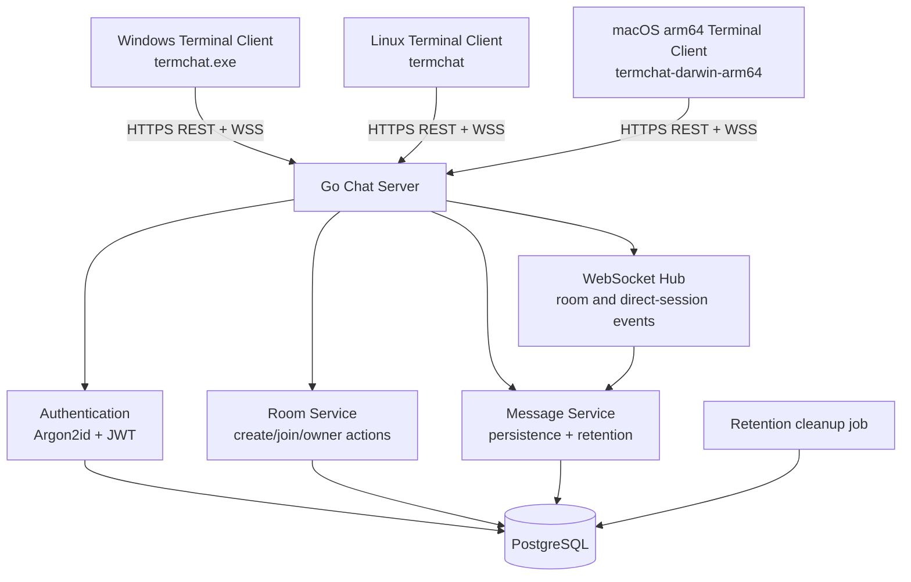

# TermChat — General Architecture

## Purpose

TermChat is a real-time chat application for Windows, Linux, and Apple Silicon macOS terminals. It uses pseudonymous user accounts and password-protected private rooms. There is no public room directory: a user must know both a room name and its password to join.

## Components

## Server responsibilities

- Register and authenticate users.
- Issue and validate JWTs.
- Create private rooms, validate room passwords, change room passwords, and delete rooms.
- Enforce owner-only room actions and consent-based room invitations.
- Authenticate and manage WebSocket connections and room/direct-session membership.
- Validate, persist, and broadcast room messages.
- Enforce per-user message rate limits.
- Apply login and room-password attempt locks.
- Periodically delete expired messages.

## Client responsibilities

- Provide registration and login flows.
- Keep JWTs, room passwords, invitation state, and message state in process memory only.
- Create rooms and run the `/join <room-name>` flow.
- Collect room passwords through masked TUI input.
- Show the latest 50 messages, append live messages, and handle commands.
- Send an application-level WebSocket heartbeat every 45 seconds and reconnect after connection loss.
- Rejoin the last room only with the room password held in process memory; clear it when rejoin fails.

## Cross-platform principles

- Build native clients from one Go codebase for Windows amd64, Linux amd64, and macOS arm64.
- Test terminal resizing, Unicode content, and Windows/Linux input behavior.
- Keep terminal input and incoming message handling separate in the Bubble Tea event loop so incoming messages never corrupt composition text.
- Do not depend on platform-specific shell commands or file paths in client business logic.
