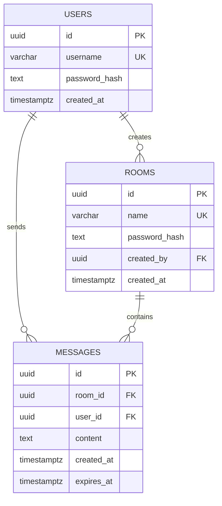

# TermChat — Data Model and Retention Schema

## Relationship diagram



## Tables

### `users`

| Field | Rule |
|---|---|
| `id` | UUID primary key |
| `username` | Unique; `^[a-z0-9_]{3,24}$` |
| `password_hash` | Argon2id output |
| `created_at` | Server-assigned UTC time |

### `rooms`

| Field | Rule |
|---|---|
| `id` | UUID primary key |
| `name` | Unique; `^[a-z0-9_-]{3,32}$` |
| `password_hash` | Argon2id output; never plaintext |
| `created_by` | `users.id` foreign key; room owner |
| `created_at` | Server-assigned UTC time |

The creator is automatically the owner. Only the owner may change a room password or delete the room. Deleting a room also deletes its related messages.

### `messages`

| Field | Rule |
|---|---|
| `id` | UUID primary key; used to suppress client duplicates |
| `room_id` | `rooms.id` foreign key |
| `user_id` | `users.id` foreign key |
| `content` | 1–2,000 characters; terminal control sequences are sanitized or rejected |
| `created_at` | Server-assigned UTC time |
| `expires_at` | `created_at + retention_period`; cleanup deletes by this value |

## Indexes

```text
users(username) UNIQUE
rooms(name) UNIQUE
messages(room_id, created_at DESC, id DESC)
messages(expires_at)
```

## Retention policy

Room messages are not retained indefinitely. Each message is stored for **one week (7 days)** after creation. `expires_at` is set to `created_at + 7 days`, and the server periodically and permanently deletes records where `expires_at <= now()`. The duration is fixed for every room; room-specific retention is outside the product scope.

Direct messages are not stored in PostgreSQL and have no history. They exist only in the memory of an active direct session and disappear when either participant leaves or disconnects, or when the server restarts.
