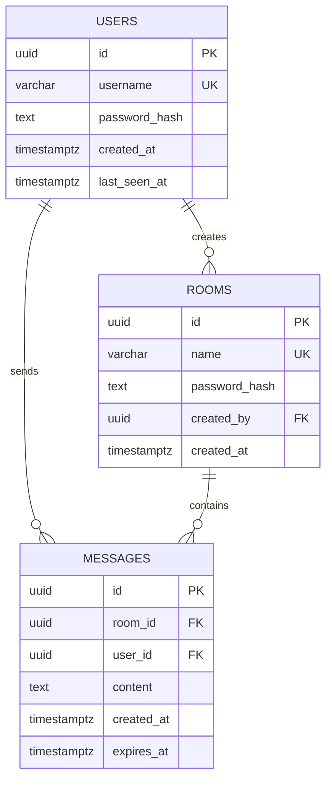

# TermChat — Veri Modeli ve Saklama Şeması

## İlişki şeması



## Tablolar

### `users`

| Alan | Kural |
|---|---|
| `id` | UUID, primary key |
| `username` | unique; `^[a-z0-9_]{3,24}$` |
| `password_hash` | Argon2id çıktısı |
| `created_at` | sunucu UTC zamanı |

### `rooms`

| Alan | Kural |
|---|---|
| `id` | UUID, primary key |
| `name` | unique; `^[a-z0-9_-]{3,32}$` |
| `password_hash` | Argon2id çıktısı; düz metin asla yok |
| `created_by` | `users.id` foreign key; oda sahibi |
| `created_at` | sunucu UTC zamanı |

Odayı oluşturan kişi otomatik olarak sahibidir. Sahip yalnızca oda parolasını değiştirebilir ve odayı silebilir. Oda silinince ilişkili mesajlar da silinir.

### `messages`

| Alan | Kural |
|---|---|
| `id` | UUID, primary key; istemci tekrarlarını elemek için kullanılır |
| `room_id` | `rooms.id` foreign key |
| `user_id` | `users.id` foreign key |
| `content` | 1–2.000 karakter; terminal kontrol dizileri temizlenir/engellenir |
| `created_at` | sunucu tarafından atanmış UTC zamanı |
| `expires_at` | `created_at + retention_period`; temizleme işi bu değere göre siler |

## İndeksler

```text
users(username) UNIQUE
rooms(name) UNIQUE
messages(room_id, created_at DESC, id DESC)
messages(expires_at)
```

## Saklama politikası

Mesajlar süresiz tutulmaz. Her mesaj oluşturulduktan sonra **1 hafta (7 gün)** saklanır. `expires_at`, `created_at + 7 gün` olarak atanır; sunucu periyodik olarak `expires_at <= now()` kayıtlarını kalıcı biçimde siler. Süre, MVP’de tüm odalar için sabittir; oda bazlı retention MVP dışıdır.
