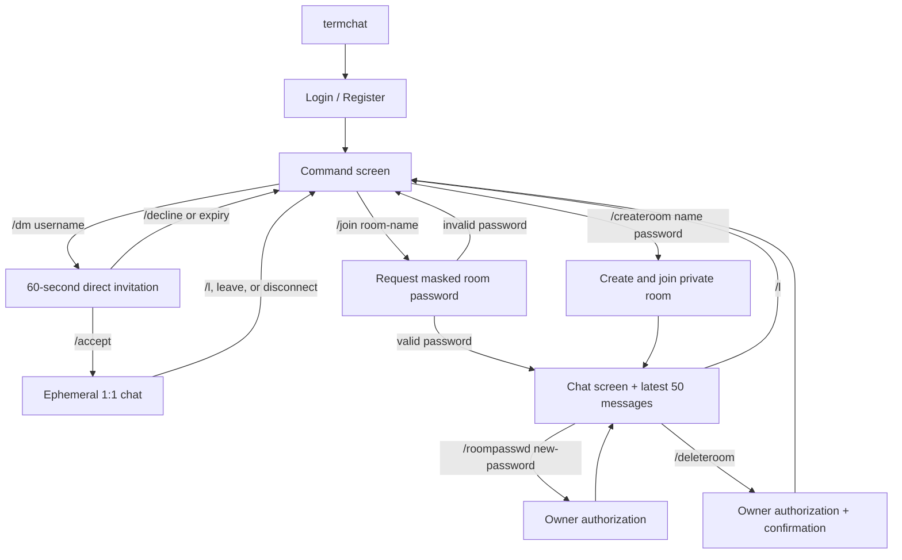

# TermChat — TUI Commands and Client–Server Protocol

## TUI user flow



## Commands

| Command | Context | Behavior |
|---|---|---|
| `/help` | Anywhere | Shows available commands |
| `/createroom <room-name> <room-password>` | Home | Creates a private room and joins it |
| `/join <room-name>` | Home | Opens a masked password prompt; never writes the password to terminal history |
| `/dm <username>` | Home | Sends an online user a consent-based direct-chat invitation that expires after 60 seconds |
| `/accept` | Home | Accepts a pending direct-chat invitation |
| `/decline` | Home | Declines a pending direct-chat invitation |
| `/l` | Room/direct chat | Leaves the room or active ephemeral direct chat |
| `/who` | Room | Shows users currently connected to the room through WebSocket |
| `/roompasswd <new-password>` | Room owner | Changes the room password |
| `/deleteroom` | Room owner | Deletes the room and its messages after explicit confirmation |
| `/deleteaccount confirm` | Anywhere | Irreversibly deletes the account, its persistent messages, and rooms it owns, then closes the active connection |
| `/theme [theme-name]` | Home or room | Opens the picker with no argument (`Tab`/`Shift+Tab`, `Enter`, `Esc`) or changes directly by name; supported themes are `amber-crt`, `green-crt`, `ice-blue`, `synthwave`, and `cyberpunk` |
| `/q` | Anywhere | Closes the client |

The default theme is `amber-crt`. Theme selection is neither sent to the server nor written to disk; restarting the client restores the default.

## REST API

```text
POST /v1/auth/register
POST /v1/auth/login
DELETE /v1/auth/account
GET  /v1/users/me
GET  /v1/rooms/{room_id}/messages?before={message_id}&limit=50
GET  /healthz
```

Successful `register` and `login` requests return a JWT. Token validation is required for REST and WebSocket requests.

## WebSocket lifecycle

```text
client -- WSS + JWT --> server
client -- join_room(name, password) --> server
server -- room_joined(room, last_50_messages, has_more) --> client
client -- load_history(before_message_id) --> server (viewport reaches top)
server -- message_history(previous_50_messages, has_more) --> client
client -- send_message(content) --> server
server -- new_message(message) --> room subscribers
```

Client events must be valid JSON in a UTF-8 WebSocket text frame no larger than 16 KiB. The server closes the connection without producing a server event for a binary frame, an oversized frame, or invalid JSON; the client follows its normal reconnect policy.

## JSON event contract

### Client → server

```json
{
  "type": "join_room",
  "request_id": "0df4d4eb-5691-478a-a22d-9c7f1cbfed2e",
  "room_name": "team_1",
  "password": "only-sent-over-tls"
}
```

```json
{
  "type": "send_message",
  "request_id": "b77e7d21-3ba7-43c8-987d-4bec63f81d00",
  "room_id": "a UUID",
  "content": "Hello"
}
```

Other room events are `leave_room`, `create_room`, `change_room_password`, `delete_room`, and `load_history`.

`load_history` works only for the room the client has currently joined. `before_message_id` is the oldest message already displayed; the server returns up to 50 older messages in chronological order.

### Server → client

```json
{
  "type": "room_joined",
  "request_id": "0df4d4eb-5691-478a-a22d-9c7f1cbfed2e",
  "room": {"id": "a UUID", "name": "team_1"},
  "messages": [],
  "has_more": true
}
```

```json
{
  "type": "message_history",
  "request_id": "optional request UUID",
  "messages": [],
  "has_more": false
}
```

```json
{
  "type": "new_message",
  "message": {
    "id": "a UUID",
    "room_id": "a UUID",
    "user": {"id": "a UUID", "username": "alice"},
    "content": "Hello",
    "created_at": "2026-08-26T15:42:00Z"
  }
}
```

```json
{
  "type": "error",
  "request_id": "optional request UUID",
  "code": "INVALID_ROOM_PASSWORD",
  "message": "Could not join the room."
}
```

## Ephemeral direct-chat contract

Direct chat does not create a room and does not use the room/message persistence path. Both participants must be online; no message delivery begins until the recipient accepts. An online user can receive an invitation while in a room or another direct chat. On acceptance, the server atomically removes both participants from their current room or direct context, sends `direct_session_ended` to a replaced peer when applicable, and starts a new exclusive direct session. An account may have only one pending direct invitation at a time. Target existence, online state, and pending-invitation state are private: a delivery failure returns only `DIRECT_UNAVAILABLE` / `Direct invitation could not be delivered.`

```text
client A -- direct_invite(target_username) --> server
server -- direct_invite_received(invite_id, counterpart, expires_at) --> client B
client B -- direct_invite_accept(invite_id) --> server
server -- direct_session_started(session_id, counterpart) --> A + B
client -- send_direct_message(content) --> server
server -- new_direct_message(message) --> A + B
client -- leave_direct --> server
server -- direct_session_ended(reason) --> A + B
```

Invitations expire after 60 seconds; the server sends `direct_invite_declined`, `direct_invite_expired`, or `direct_invite_cancelled` to the relevant client. Direct messages are never written to PostgreSQL, are unavailable through the REST history endpoint, and are removed from memory when the server restarts, either participant disconnects, or either participant leaves. Their format and per-user limit of five messages per two seconds match room messages.

Direct-chat client events are `direct_invite` (`target_username`), `direct_invite_accept` (`invite_id`), `direct_invite_decline` (`invite_id`), `send_direct_message` (`content`), and `leave_direct`.

Direct-chat server events are `direct_invite_sent`, `direct_invite_received`, `direct_invite_declined`, `direct_invite_expired`, `direct_invite_cancelled`, `direct_session_started`, `new_direct_message`, and `direct_session_ended`.

## Client notification model

The header persistently shows `[ONLINE]`, `[CONNECTING]`, `[RECONNECTING]`, or `[OFFLINE]`. A successful 45-second heartbeat `pong` produces no user notification; only state changes such as a timeout or reconnect become visible.

Normal `[INFO]`, `[OK]`, `[WARN]`, and `[ERROR]` messages appear as a single timed toast in the top-right corner and disappear automatically. A newer normal message replaces the visible toast. Durations are 4 seconds for information/success, 8 seconds for warnings, and 12 seconds for errors. `direct_invite_received` is a separate `[INVITE]` action banner that remains visible until `/accept`, `/decline`, or expiry and cannot be replaced by normal toasts or heartbeat traffic.

## Security rules

- JWTs travel only through TLS/WSS and expire after one hour by default; a user must log in again when a new authentication or reconnect needs an expired token.
- User and room passwords are hashed with Argon2id.
- `/join` never accepts a room password as a command argument; it uses masked input.
- The server enforces message length, name format, and authorization.
- The message rate limit is five messages per user every two seconds.
- Tokens, passwords, and raw message content are not written to server logs; the server logger filters these attributes as `[REDACTED]`.
