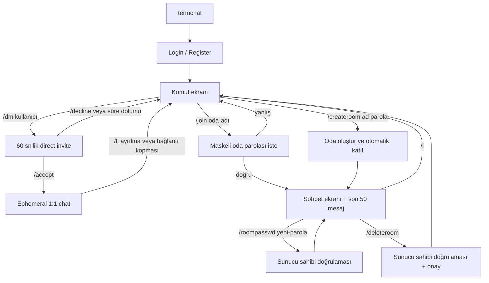

# TermChat — TUI Komutları ve İstemci–Sunucu Protokolü

## TUI kullanıcı akışı



## MVP komutları

| Komut | Bağlam | Davranış |
|---|---|---|
| `/help` | her yer | kullanılabilir komutları gösterir |
| `/createroom <oda-adı> <oda-parolası>` | ana ekran | oda oluşturur ve kullanıcıyı odaya alır |
| `/join <oda-adı>` | ana ekran | maskeli parola istemi açar; parolayı terminal geçmişine yazmaz |
| `/dm <kullanıcı-adı>` | ana ekran | online kullanıcıya 60 sn geçerli, kabul gerektiren direct-chat daveti yollar |
| `/accept` | ana ekran | bekleyen direct-chat davetini kabul eder |
| `/decline` | ana ekran | bekleyen direct-chat davetini reddeder |
| `/l` | oda/direct chat | odayı veya aktif ephemeral direct chat'i terk eder |
| `/who` | oda | o an WebSocket ile bağlı oda kullanıcılarını gösterir |
| `/roompasswd <yeni-parola>` | oda sahibi | oda parolasını değiştirir |
| `/deleteroom` | oda sahibi | açık onaydan sonra oda ve mesajlarını siler |
| `/theme [tema-adı]` | ana ekran veya oda | argümansız kullanımda `Tab`/`Shift+Tab` ile gezinilen, `Enter` ile uygulanan ve `Esc` ile kapatılan tema seçiciyi açar; tema adı verilirse doğrudan değiştirir. `amber-crt`, `green-crt`, `ice-blue`, `synthwave`, `cyberpunk` desteklenir |
| `/q` | her yer | istemciyi kapatır |

Varsayılan tema `amber-crt`'dir. Tema seçimi sunucuya gönderilmez ve diske yazılmaz; client yeniden başlatıldığında varsayılana döner.

## REST API

```text
POST /v1/auth/register
POST /v1/auth/login
GET  /v1/users/me
GET  /v1/rooms/{room_id}/messages?before={message_id}&limit=50
GET  /healthz
```

`register` ve `login` başarılı olduğunda istemciye JWT döner. REST ve WebSocket isteklerinde token doğrulaması zorunludur.

## WebSocket yaşam döngüsü

```text
client -- WSS + JWT --> server
client -- join_room(name, password) --> server
server -- room_joined(room, last_50_messages, has_more) --> client
client -- load_history(before_message_id) --> server (viewport reaches top)
server -- message_history(previous_50_messages, has_more) --> client
client -- send_message(content) --> server
server -- new_message(message) --> room subscribers
```

## JSON olay sözleşmesi

### İstemci → sunucu

```json
{
  "type": "join_room",
  "request_id": "0df4d4eb-5691-478a-a22d-9c7f1cbfed2e",
  "room_name": "ekip_1",
  "password": "only-sent-over-tls"
}
```

```json
{
  "type": "send_message",
  "request_id": "b77e7d21-3ba7-43c8-987d-4bec63f81d00",
  "room_id": "a UUID",
  "content": "Merhaba"
}
```

Ek olaylar: `leave_room`, `create_room`, `change_room_password`, `delete_room`, `load_history`.

`load_history` yalnızca istemcinin o anda katıldığı oda için çalışır. `before_message_id`, zaten gösterilen en eski mesajdır; sunucu bu mesajdan daha eski en fazla 50 mesajı kronolojik sırayla döndürür.

### Sunucu → istemci

```json
{
  "type": "room_joined",
  "request_id": "0df4d4eb-5691-478a-a22d-9c7f1cbfed2e",
  "room": {"id": "a UUID", "name": "ekip_1"},
  "messages": [],
  "has_more": true
}
```

```json
{
  "type": "message_history",
  "request_id": "optional request UUID",
  "messages": [],
  "has_more": false
}
```

```json
{
  "type": "new_message",
  "message": {
    "id": "a UUID",
    "room_id": "a UUID",
    "user": {"id": "a UUID", "username": "alice"},
    "content": "Merhaba",
    "created_at": "2026-08-26T15:42:00Z"
  }
}
```

```json
{
  "type": "error",
  "request_id": "optional request UUID",
  "code": "INVALID_ROOM_PASSWORD",
  "message": "Odaya katılım başarısız."
}
```

## Ephemeral direct-chat sözleşmesi

Direct chat oda oluşturmaz ve room/message persistence akışını kullanmaz. Başlatan ve hedef kullanıcı aynı anda online olmalıdır; hedef kabul etmeden mesaj iletimi başlamaz. Bir kullanıcı aynı anda yalnız bir direct invite veya direct chat bağlamında bulunabilir; direct chat sırasında room bağlamına geçmek, önce direct oturumu sonlandırır.

```text
client A -- direct_invite(target_username) --> server
server -- direct_invite_received(invite_id, counterpart, expires_at) --> client B
client B -- direct_invite_accept(invite_id) --> server
server -- direct_session_started(session_id, counterpart) --> A + B
client -- send_direct_message(content) --> server
server -- new_direct_message(message) --> A + B
client -- leave_direct --> server
server -- direct_session_ended(reason) --> A + B
```

Invite'lar 60 saniye sonra sona erer; `direct_invite_declined`, `direct_invite_expired` ve `direct_invite_cancelled` olayları ilgili istemciye gönderilir. Direct mesajlar PostgreSQL'e yazılmaz, REST history endpoint'iyle alınamaz ve sunucunun yeniden başlaması, bağlantının kopması veya bir tarafın ayrılmasıyla bellekten silinir. Mesaj biçimi ve kullanıcı başına 2 saniyede 5 mesaj sınırı room mesajlarıyla aynıdır.

İstemci olayları: `direct_invite` (`target_username`), `direct_invite_accept` (`invite_id`), `direct_invite_decline` (`invite_id`), `send_direct_message` (`content`) ve `leave_direct`.

Sunucu olayları: `direct_invite_sent`, `direct_invite_received`, `direct_invite_declined`, `direct_invite_expired`, `direct_invite_cancelled`, `direct_session_started`, `new_direct_message`, `direct_session_ended`.

## İstemci bildirim modeli

Bağlantı durumu header'da kalıcı `[ONLINE]`, `[CONNECTING]`, `[RECONNECTING]` veya `[OFFLINE]` rozetiyle gösterilir. 45 saniyelik heartbeat'in başarılı `pong` yanıtı kullanıcıya bildirim üretmez; yalnız timeout veya reconnect gibi durum değişiklikleri görünür olur.

Normal `[INFO]`, `[OK]`, `[WARN]` ve `[ERROR]` mesajları üç öğelik bounded notification tray içinde birlikte gösterilir; yeni mesaj önceki okunabilir mesajı tek satırlık footer'dan silmez. `direct_invite_received` ayrı bir `[INVITE]` action banner'ıdır: `/accept`, `/decline` veya invite expiry olana kadar görünür kalır ve normal bildirimler ile heartbeat tarafından ezilemez.

## Güvenlik kuralları

- JWT yalnızca TLS/WSS üzerinden taşınır.
- Kullanıcı ve oda parolaları Argon2id ile hashlenir.
- `/join` oda parolasını komut argümanı olarak almaz; maskeli input kullanır.
- Sunucu; mesaj uzunluğu, isim formatı ve yetki kontrolünü uygular.
- Mesaj hız sınırı kullanıcı başına 2 saniyede 5 mesajdır.
- Token, parola ve ham mesaj içeriği sunucu loglarına yazılmaz.
