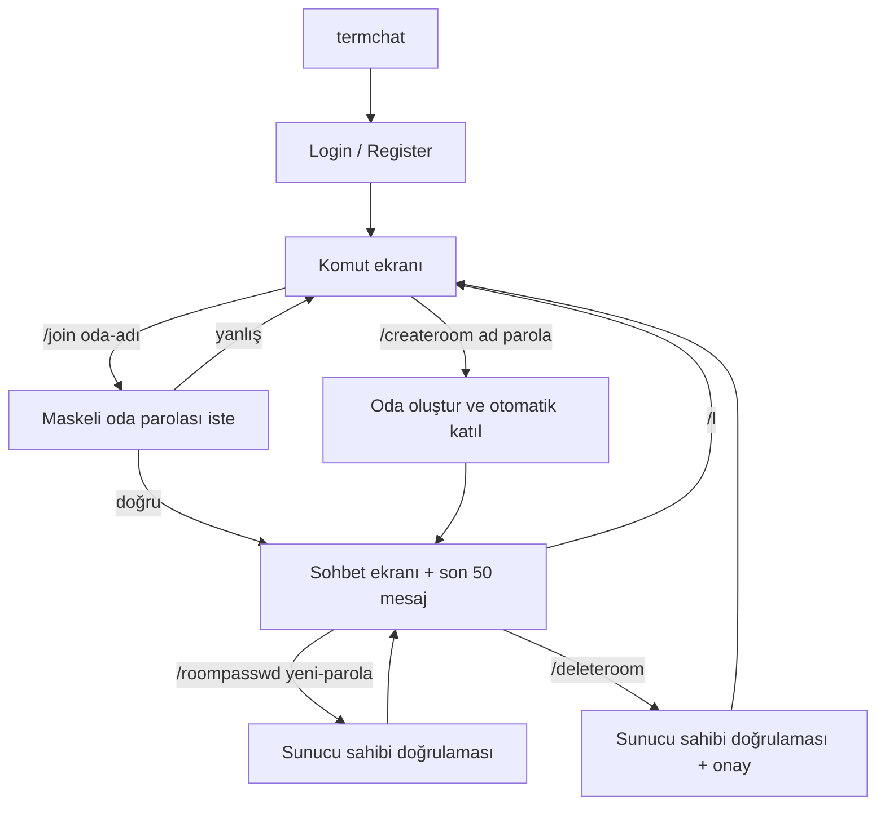

# TermChat — TUI Komutları ve İstemci–Sunucu Protokolü

## TUI kullanıcı akışı



## MVP komutları

| Komut | Bağlam | Davranış |
|---|---|---|
| `/help` | her yer | kullanılabilir komutları gösterir |
| `/createroom <oda-adı> <oda-parolası>` | ana ekran | oda oluşturur ve kullanıcıyı odaya alır |
| `/join <oda-adı>` | ana ekran | maskeli parola istemi açar; parolayı terminal geçmişine yazmaz |
| `/l` | oda | odadan ayrılır, ana ekrana döner |
| `/who` | oda | o an WebSocket ile bağlı oda kullanıcılarını gösterir |
| `/roompasswd <yeni-parola>` | oda sahibi | oda parolasını değiştirir |
| `/deleteroom` | oda sahibi | açık onaydan sonra oda ve mesajlarını siler |
| `/q` | her yer | istemciyi kapatır |

## REST API

```text
POST /v1/auth/register
POST /v1/auth/login
GET  /v1/users/me
GET  /v1/rooms/{room_id}/messages?before={message_id}&limit=50
GET  /healthz
```

`register` ve `login` başarılı olduğunda istemciye JWT döner. REST ve WebSocket isteklerinde token doğrulaması zorunludur.

## WebSocket yaşam döngüsü

```text
client -- WSS + JWT --> server
client -- join_room(name, password) --> server
server -- room_joined(room, last_50_messages) --> client
client -- send_message(content) --> server
server -- new_message(message) --> room subscribers
```

## JSON olay sözleşmesi

### İstemci → sunucu

```json
{
  "type": "join_room",
  "request_id": "0df4d4eb-5691-478a-a22d-9c7f1cbfed2e",
  "room_name": "ekip_1",
  "password": "only-sent-over-tls"
}
```

```json
{
  "type": "send_message",
  "request_id": "b77e7d21-3ba7-43c8-987d-4bec63f81d00",
  "room_id": "a UUID",
  "content": "Merhaba"
}
```

Ek olaylar: `leave_room`, `create_room`, `change_room_password`, `delete_room`.

### Sunucu → istemci

```json
{
  "type": "room_joined",
  "request_id": "0df4d4eb-5691-478a-a22d-9c7f1cbfed2e",
  "room": {"id": "a UUID", "name": "ekip_1"},
  "messages": []
}
```

```json
{
  "type": "new_message",
  "message": {
    "id": "a UUID",
    "room_id": "a UUID",
    "user": {"id": "a UUID", "username": "alice"},
    "content": "Merhaba",
    "created_at": "2026-08-26T15:42:00Z"
  }
}
```

```json
{
  "type": "error",
  "request_id": "optional request UUID",
  "code": "INVALID_ROOM_PASSWORD",
  "message": "Odaya katılım başarısız."
}
```

## Güvenlik kuralları

- JWT yalnızca TLS/WSS üzerinden taşınır.
- Kullanıcı ve oda parolaları Argon2id ile hashlenir.
- `/join` oda parolasını komut argümanı olarak almaz; maskeli input kullanır.
- Sunucu; mesaj uzunluğu, isim formatı ve yetki kontrolünü uygular.
- Mesaj hız sınırı kullanıcı başına 2 saniyede 5 mesajdır.
- Token, parola ve ham mesaj içeriği sunucu loglarına yazılmaz.
